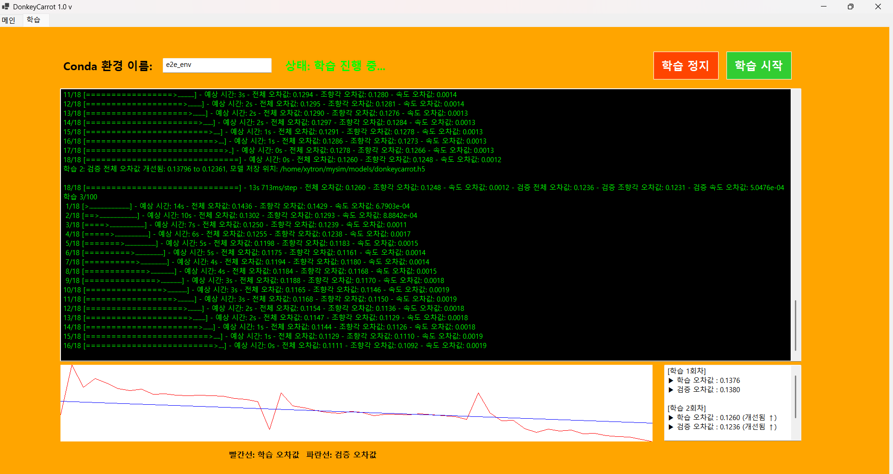

## (메인 화면 추가한 기능)

- 사용한 컨트롤:

 - 구현 내용 및 기능 설명
  - 파일 불러오기
   - 카탈로그 파일 불러오기, 이미지 파일 불러오기 버튼을 통해 폴더를 선택하여 데이터를 로드
   - 불러온 경로의 마지막 폴더명을 카탈로그 경로, 이미지 경로 라벨에 표시
   - 경로 라벨에 마우스를 올리면 전체 경로를 ToolTip으로 확인 가능
 - 데이터 표시
   - 불러온 카탈로그 및 이미지 데이터를 기반으로 이미지 출력
   - 데이터 목록을 분석하여 파일 목록과 복구 목록 자동 생성
 - 그래프 기능
   - 불러온 데이터를 기반으로 조향각(Angle) 및 속도(Throttle) 그래프 생성
   - 체크박스를 통해 원하는 그래프 선택 가능
 - 이미지 탐색 기능
   - '>' 버튼 : 다음 이미지로 1프레임 이동
   - '>>' 버튼 : 연속 재생 시작
   - Stop 버튼 : 연속 재생 정지
   - 재생바(TrackBar) 를 이용하여 원하는 프레임으로 즉시 이동 가능
   - 연속 재생 시 현재 프레임에 맞춰 재생바 자동 이동
 - 재생 속도 조절
   - 콤보박스를 이용하여 이미지 재생 속도 조절 가능
 - 학습 모델 비교 기능
   - 학습 모델 선택 버튼을 통해 학습된 모델 불러오기
   - 모델이 예측한 조향각을 빨간선으로 출력
   - 실제 운전자의 조향각을 초록선으로 출력
   - 실제 데이터와 학습 모델의 예측 결과 비교 가능
   - 학습된 Pilot 모델(.h5)을 불러와 이미지별 조향각을 예측하는 기능 구현
   - 실제 조향각(user/angle)은 초록색 방향선으로 표시
   - 모델 예측 조향각은 빨간색 방향선으로 표시
   - 실제 주행 데이터와 AI 예측 결과를 실시간으로 비교 가능
   - Python 예측 서버를 이용하여 빠른 예측 기능 구현
 - 파일 관리 기능
   - 선택한 데이터를 삭제 가능
   - 삭제된 데이터는 복구 목록으로 이동
   - 복구 기능을 통해 삭제된 데이터를 원래 목록으로 복원 가능
 - 추가한 기능
   - 카탈로그 및 이미지 파일 불러오기
   - 파일 경로 표시 및 ToolTip 경로 확인 기능
   - 파일 목록 및 복구 목록 생성
   - 이미지 뷰어 및 프레임 이동 기능
   - 재생바 연동 및 재생 속도 조절 기능
   - 조향각·속도 그래프 시각화
   - 학습 모델 조향각 비교 기능
   - 파일 삭제 및 복구 기능
   - 실제 운전자 조향각 표시 기능
   - 학습 모델 예측 조향각 표시 기능

 - 조건 기반 데이터 검색 기능
   - 사용자가 조향각(Angle)과 속도(Throttle)의 최소값 및 최대값을 입력한 후 찾기 버튼을  - 누르면 조건에 해당하는 데이터만 필터링하여 표시
   - 검색 조건에 부합하는 이미지와 주행 데이터를 파일 목록에 출력
   - 대량의 주행 데이터 중 원하는 구간을 빠르게 탐색 가능
 - 검색 조건 초기화 기능
   - 초기화 버튼을 누르면 입력된 조향각 및 속도 조건을 모두 초기 상태로 복원
   - 필터링된 결과를 해제하고 전체 데이터를 다시 확인 가능
 - 파일 삭제 및 복구 기능
   - 사용한 컨트롤
   - ListBox
   - TabControl
   - TabPage
   - Button
 - 구현 내용 및 기능 설명
  - 카탈로그 및 이미지 파일 동기화 삭제
   - 파일 목록에서 선택한 데이터를 삭제하면 이미지 파일과 카탈로그 데이터가 함께 삭제되도록 구현
   - 실제 저장 데이터와 화면 목록의 일관성 유지
  - 임시 복구(휴지통) 기능
   - 삭제된 데이터를 즉시 영구 삭제하지 않고 별도의 복구 폴더로 이동하도록 구현
   - 실수로 삭제한 데이터를 복구할 수 있도록 안전성 확보
  - 데이터 복구 기능
   - 복구 목록에서 원하는 데이터를 선택한 후 복구 버튼을 누르면 원래 위치로 복원
   - 이미지 파일과 카탈로그 데이터를 함께 복구
   - 삭제 이전 상태로 주행 데이터 복원 가능
 - 기능 화면
   - 메인 화면 스크린샷 삽입
   - 데이터 검색 화면 스크린샷 삽입
   - 삭제 및 복구 기능 화면 스크린샷 삽입

## (추가한 기능)

- 사용한 컨트롤: Label, Button, TextBox, PictureBox

- 구현 내용과 기능 설명
   - 사용자가 원하는 Conda 환경에서 DonkeyCar 학습을 진행할 수 있게 사용자가 TextBox에 Conda 환경 이름을 입력하면, 입력된 환경 이름을 기준으로 학습 명령이 실행되도록 구현
   - 학습이 진행 중일 때 '학습 정지' 버튼을 누르면 실행 중인 학습 프로세스가 중지되도록 설정
   - 학습이 진행되면서 오차값이 어떻게 변화하는지 시각적으로 확인할 수 있게 학습 과정에서 출력되는 학습 오차값과 검증 오차값을 읽어와 PictureBox에 그래프로 표시
   - 사용자가 학습 상태를 쉽게 파악할 수 있도록 학습 오차값과 검증 오차값을 이전 값과 비교하여 개선되었는지 또는 악화되었는지를 TextBox에 표시하도록 구현